# Documentació del Projecte - Control de Versions amb Git Flow

## 1. Introducció

En aquest projecte hem utilitzat **Git**, un sistema de control de versions distribuït que ens permet portar un seguiment detallat dels canvis en el codi, treballar de manera col·laborativa i recuperar versions anteriors si és necessari.  

A més, hem aplicat la metodologia **Git Flow**, que consisteix en utilitzar branques específiques amb una finalitat clara:  

- `develop`: branca principal de desenvolupament.  
- `feature/...`: branques per implementar noves funcionalitats.  
- `release/...`: branques per preparar versions estables.  
- `hotfix/...`: branques per corregir errors crítics en versions ja publicades.  
- `master` o `main`: branca estable del projecte.  

La utilització de Git Flow ens ha permès treballar de manera ordenada, assignar tasques a diferents usuaris i tenir un historial clar de tots els canvis.

---

## 2. Procés realitzat

### Usuari 1

1. Inicialitza el **Git Flow** al repositori (branques predeterminades).  
   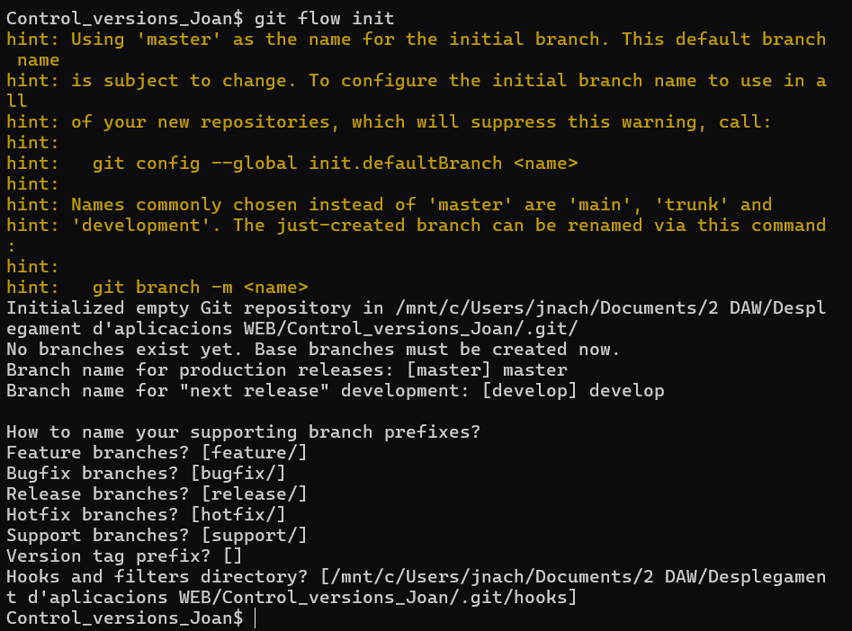

2. Comença la **feature `estructura-inicial`** i crea el *boilerplate* en la carpeta del projecte.  
   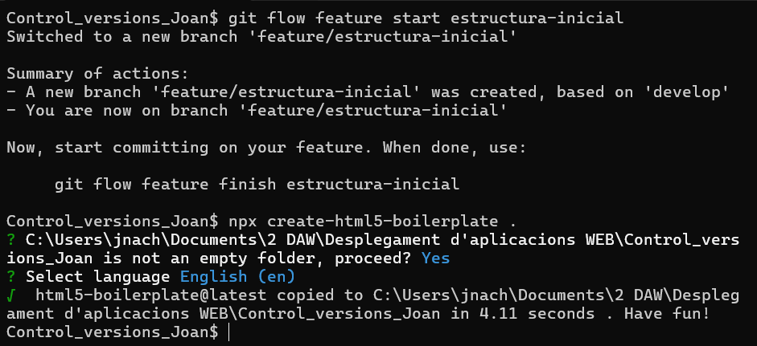

3. Primer commit per documentar la feature, segon commit amb modificació del `index.html`. Finalitza la feature.  
   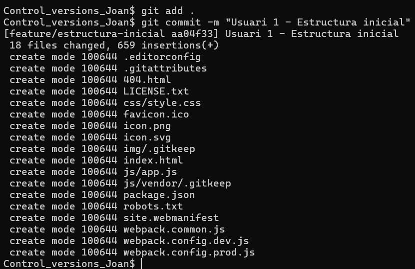
   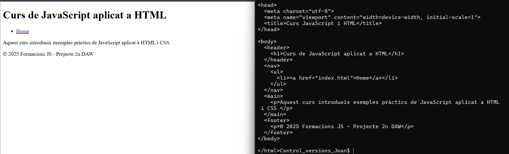
   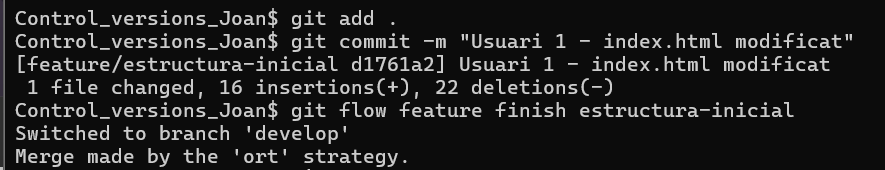
   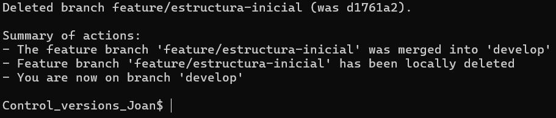
   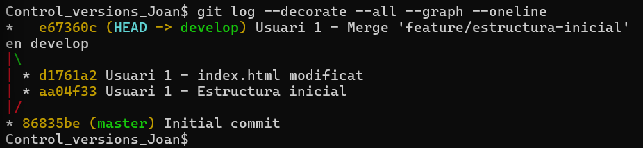

---

### Usuari 2

1. **Feature `modificar-contingut`**:  
    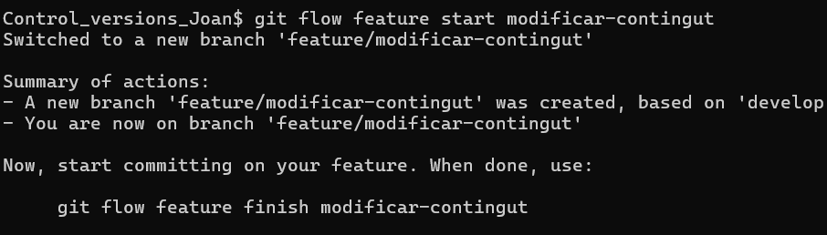
   - Primer commit: modificació del menú de `index.html` per enllaçar al nou fitxer HTML.  
     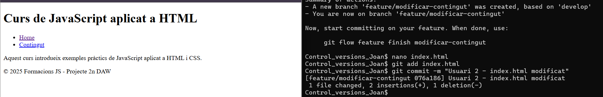  
   - Segon commit: creació de `contingut.html` amb el contingut demanat.  
     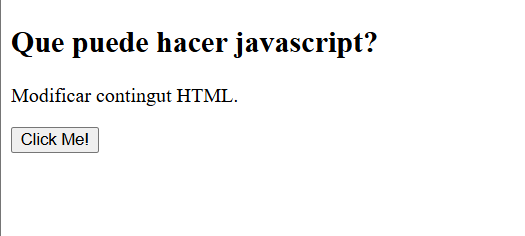  
     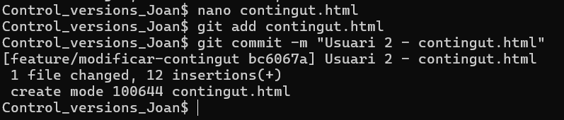  
   - Finalitza la feature.  
     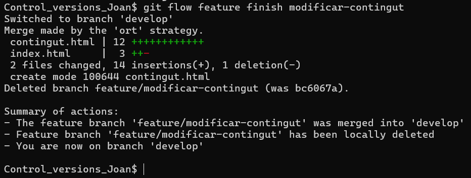

2. **Feature `modificar-atributs`**:  
    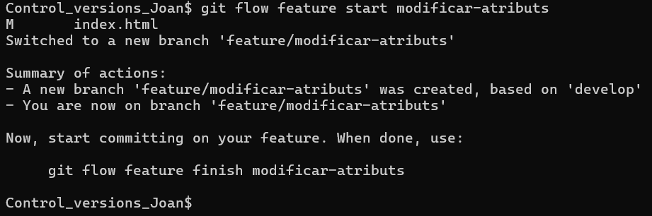
   - Primer commit: modificació del menú de `index.html`.  
     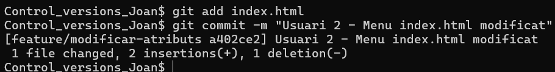  
   - Segon commit: creació i modificació de `atributs.html`.  
     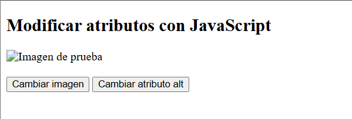  
     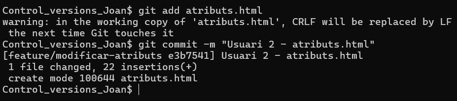  
   - Finalitza la feature.  
     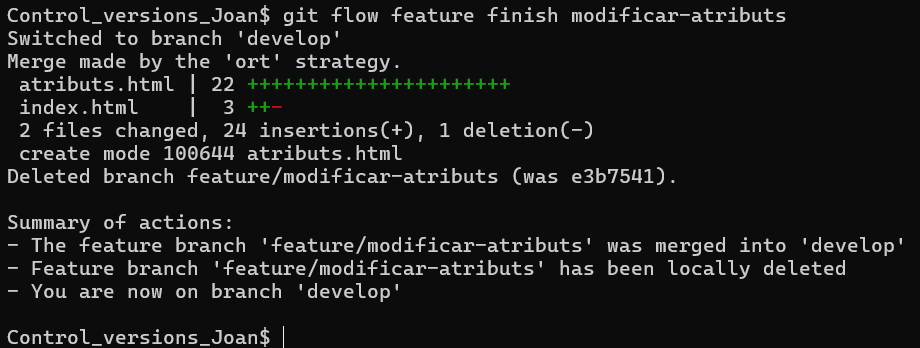

> Així és l’estructura del projecte en aquest punt.  
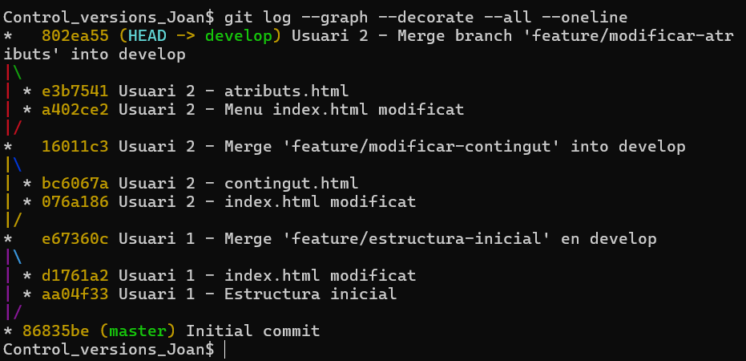

---

### Usuari 3

1. **Feature `modificar-css`**:  
     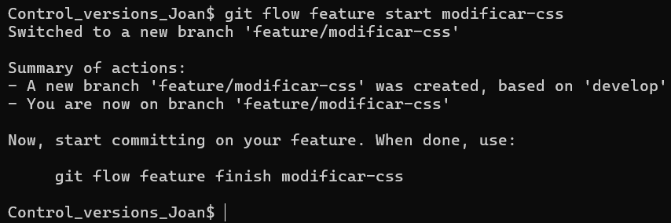  
   - Primer commit: modificació del menú de `index.html`.  
     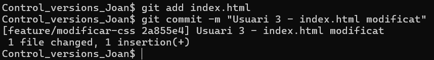  
   - Segon commit: creació i modificació de `estilsCSS.html`.  
     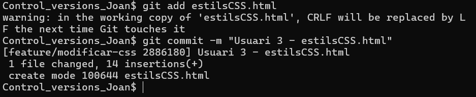  
   - Finalitza la feature.  
     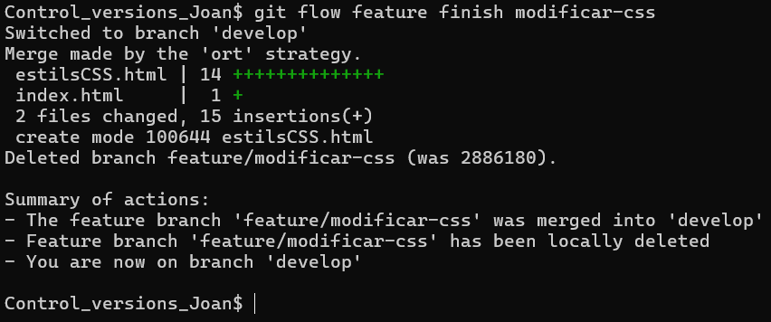

2. **Release `v1.0`**: inici i finalització.  
   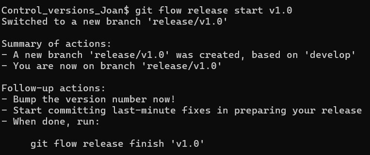
   
   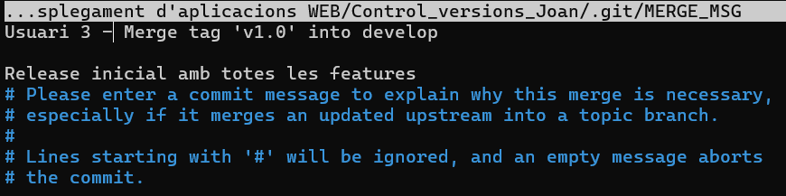
   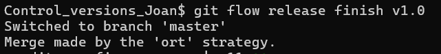

> Estructura del projecte després de la release v1.0  
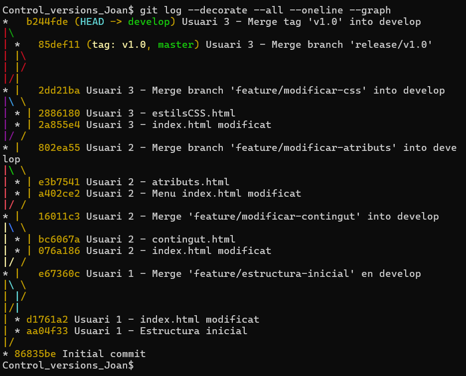

---

### Usuari 1 - Hotfix

1. **Hotfix `milloresV_1_0`**:  
   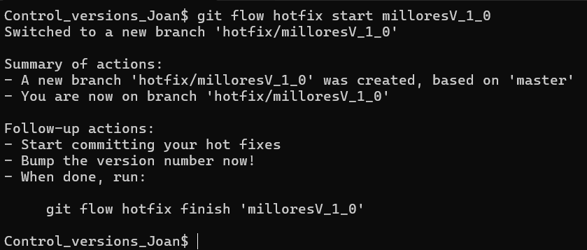
   - Primer commit: modificació de `contingut.html`.  
     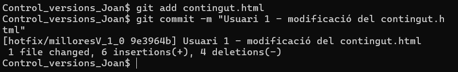  
   - Segon commit: modificació de `atributs.html`.  
     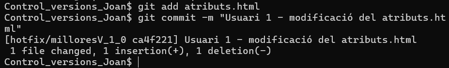  
   - Finalitza el hotfix.  
     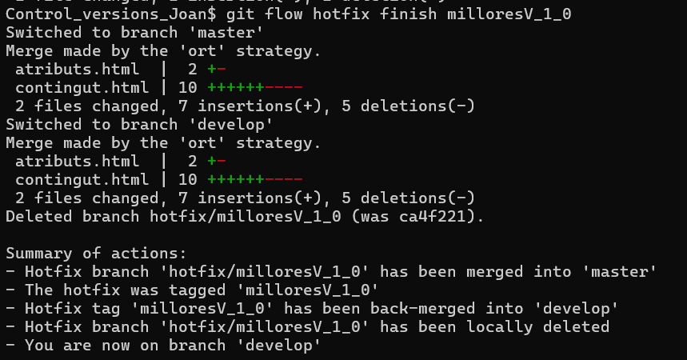

> Estructura final del projecte  
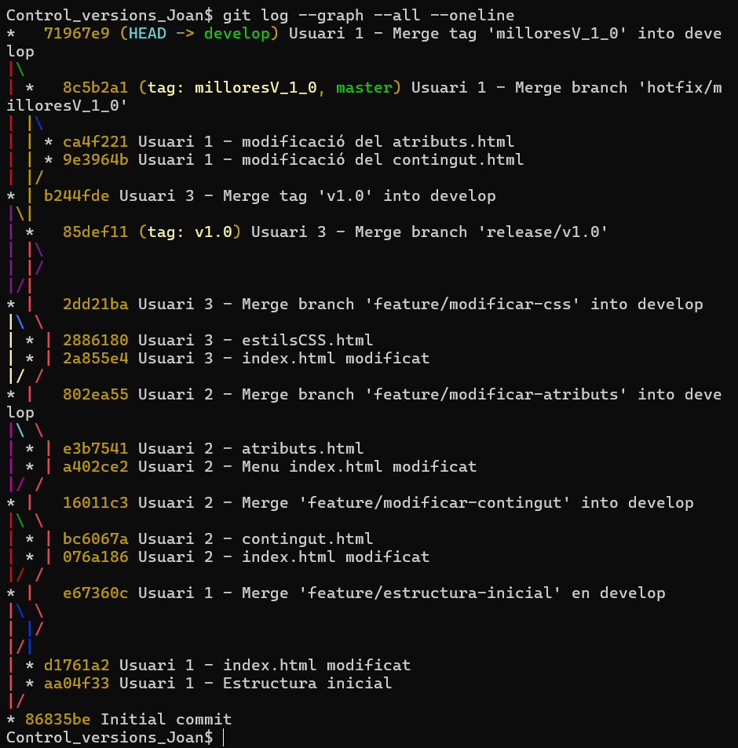

---

## 3. Conclusió

Amb aquest procés hem pogut veure com **Git Flow organitza el desenvolupament**, permetent treballar de manera col·laborativa, implementar noves funcionalitats en *features*, preparar versions estables amb *releases* i corregir errors amb *hotfixes*.  

La documentació creada a la branca `gh-pages` permet visualitzar tot el procés, incloent els commits, les branques i les captures del treball realitzat.
